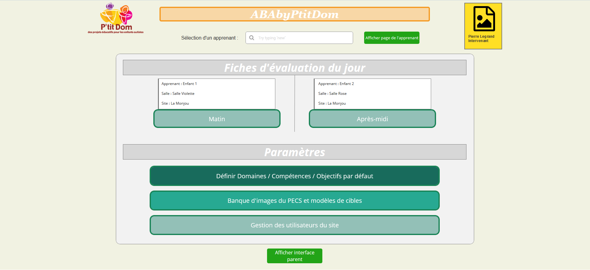
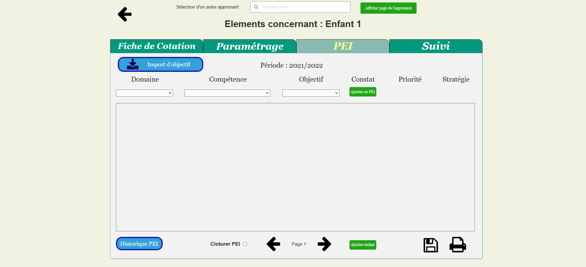
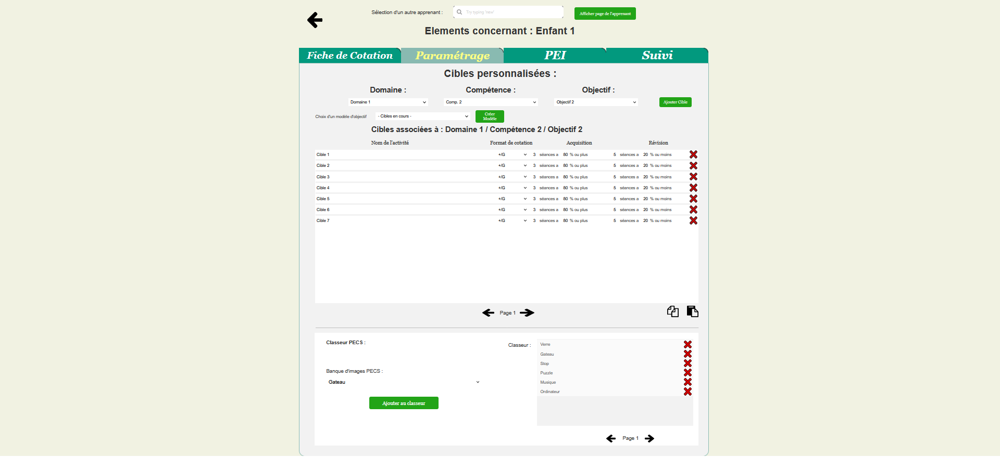
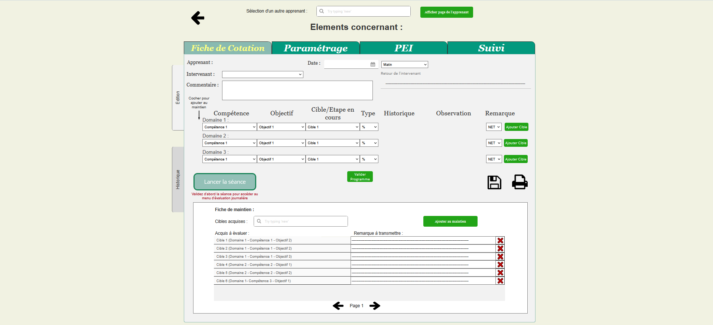
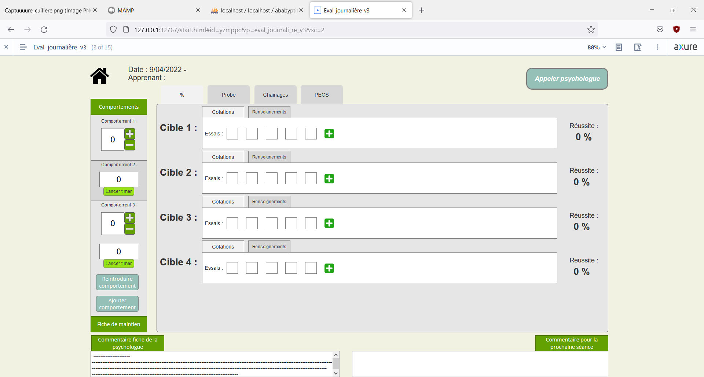
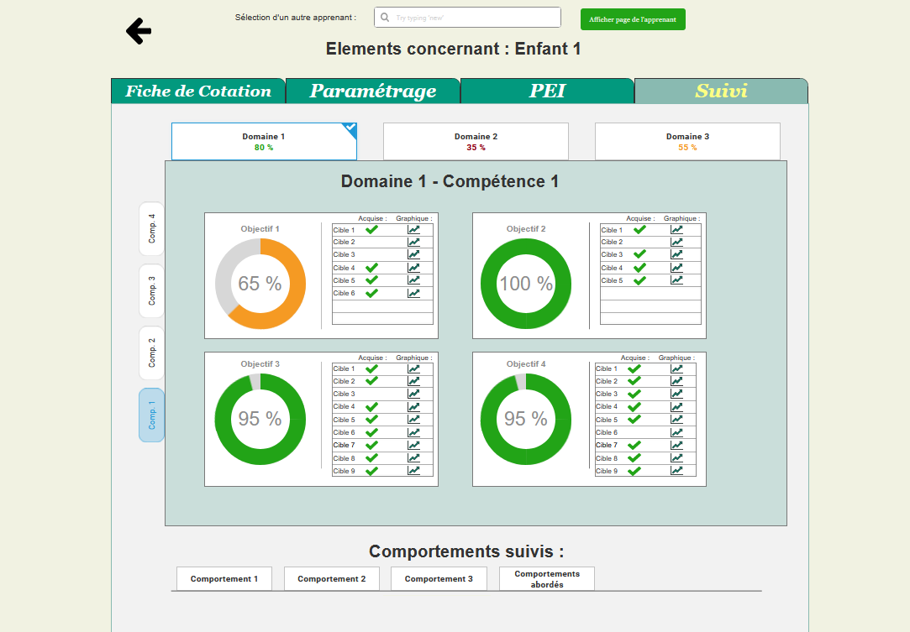
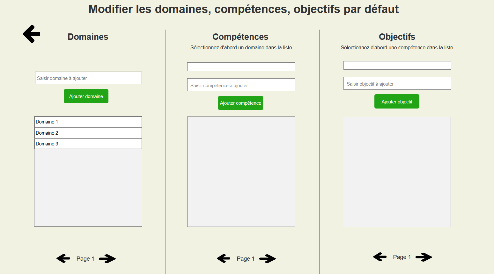
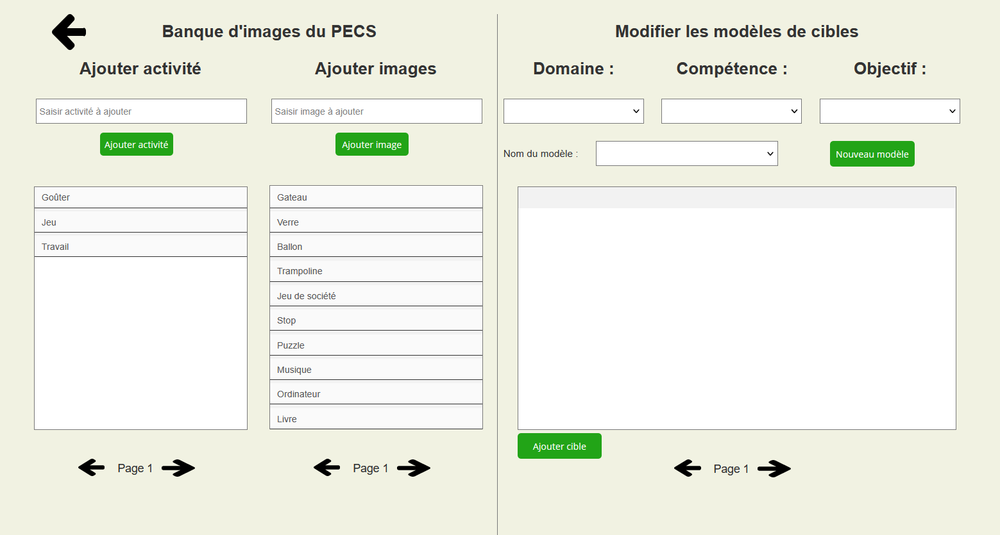
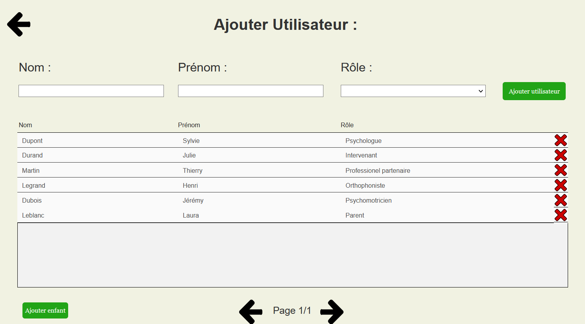

# Documentation de l’application et de ses interactions avec la base de données illustrée par les pages de la maquette

## Introduction

Ce document a pour but de présenter l’application et la base de données en indiquant les interactions entre les deux ainsi que les fonctionnalités présentes page par page, grâce à des captures d’écrans de la maquette, un récapitulatif des fonctionnalités principales contenues sur chaque page en capture d’écran, les tables spécifiquement impliquées pour ces fonctionnalités et quelques requêtes `SQL` plus élaborées à titre d’exemple. L’ensemble des requêtes `SQL` qui ont déjà été écrites pour les 3 premières pages présentées (Page d’accueil, PEI, Paramétrage des cibles personnalisées) peuvent être retrouvées dans le document `requetes_sql`. Un autre document joint (`NOM DU DOCUMENT`) contient un descriptif de l’ensemble des fonctionnalités qui ne sont pas encore incluses dans la maquette ou la base de données, mais qui ont été étudiées et qu’il a été prévu d’intégrer à l’application.

## Page d’accueil



Sur la page d’accueil, un utilisateur verra les deux prochaines séances qui lui sont assignées, il pourra sélectionner un apprenant pour accéder aux différentes pages propres à cet apprenant, et selon les droits liés au statut de l’utilisateur, il pourra éventuellement accéder aux différentes pages de paramétrages de l’application.

La page d’accueil va interagir avec les tables `apprenants`, `seances`, `utilisateurs` et `roles`.

- `apprenants` : pour récupérer l’ensemble des apprenants actifs dans la barre de recherche.
- `utilisateur` et `role` : pour récupérer le rôle de l'utilisateur.
- `seances` : pour récupérer les informations des deux prochaines séances attribuées à l’utilisateur.

## PEI



Cette page permet de créer un PEI, d’y ajouter des objectifs individuellement ou en les important depuis un PEI antérieur, de définir leurs prérequis, de faire des avenants au PEI et de consulter l’historique des PEIs de l’apprenant.  
La page PEI interagit avec les tables `peis`, `objectifs_peis`, `prerequis`, `objectifs`, `objectifs_competences`, `competences`, `competences_domaines` et `domaines`.  
Pour récupérer l’ensemble des objectifs contenus dans le PEI en cours d’un apprenant, et les compétences et domaines dans lesquels ils sont inclus, voici à titre d’exemple la requête `SQL` qui va interagir avec l’ensemble de tables mentionnées ci-dessus, excepté la table `prerequis` :

```SQL
SELECT domaines.nom, competences.nom, objectifs.nom FROM domaines, competences_domaines, competences, objectifs_competences, objectifs, objectifs_peis, peis
WHERE peis.identifiant_apprenant="apprenant1"
AND peis.cloture IS NULL
AND peis.id=objectifs_peis.id_pei
AND objectifs_peis.nom_objectif=objectifs.nom
AND objectifs.nom=objectifs_competences.nom_objectif
AND objectifs_competences.nom_competence=competences.nom
AND competences.nom=competences_domaines.nom_competence
AND competences_domaines.nom_domaine=domaines.nom
ORDER BY domaines.nom, competences.nom, objectifs.nom
```

## Paramétrage des cibles personnalisées



Cette page permet de définir les cibles des objectifs propres à un apprenant. Ces cibles peuvent être ajoutées et retirées individuellement, ou importées depuis des modèles récupérables pour chaque apprenant et qu’il est possible de définir depuis cette même page. Il est également possible de copier la sélection des cibles d’un objectif d’un apprenant pour les coller chez un autre apprenant. De plus, sur cette page s’effectue la gestion du classeur PECS de l’apprenant.

Cette page interagit spécifiquement avec les tables `modeles`, `cibles_defaut`, `cibles_individuelles`.  
Elle interagit avec les tables `peis_objectifs`, `objectifs`, `objectifs_competences`, `compétences`, `competences_domaines` et `domaines` pour récupérer l’ensemble des objectifs du PEI de l’apprenant.  
Elle interagit en particulier avec la table `log_cibles` pour déterminer si des cotations sont enregistrées pour une cible ou si elle est vierge, ce qui influencera la façon dont elle sera supprimée de la liste des cibles d’un objectif, de sorte à ne pas perdre les enregistrements si elle en contient.

## Fiche de cotation



Cette page permet de créer une fiche de cotation assignée à un intervenant, pour une séance et un apprenant donné. Cela consiste donc à ajouter des objectifs du PEI à la séance et à définir pour chacun les modalités d’évaluation. On accède depuis cette page à la fiche d’évaluation journalière d’un apprenant en cliquant sur le bouton « Lancer une séance ». La gestion des cibles en maintien se fait également depuis cette page avec la possibilité d’ajouter ou de retirer des cibles de la liste des maintiens.  
Cette page va ainsi interagir spécifiquement avec les tables `seances`, `cibles_seances`, `cibles_individuelles`, `comportements_seances` (le choix des comportements présents dans une fiche d’évaluation se fait depuis la page Suivi) et la table `validations`.

## Fiche d’évaluation journalière



Cette page permet de rentrer les évaluations pour les différents types de cibles intégrées à la fiche de cotation, de compter l’apparition des comportements au cours de la séance et d’évaluer les cibles en maintien.
Elle va essentiellement interagir avec les tables `log_cibles` et `log_comportements`.

## Suivi



Le but de cette page est de présenter les statistiques des différents domaines, compétences et objectifs du PEI de l'apprenant, pour suivre sa progression. Elle indique pour chaque objectif les cibles qui sont validées ou non et donc le pourcentage d'acquisition d'un objectif. Elle permet d'accéder plus en détail à des graphiques faisant office d'historique, résumant pour une cible ses scores pour chaque séance au fil du temps. Ces graphiques varieront selon le type de cible (classiques, PECS ou chainage). Un graphique du pourcentage de validation de l'objectif au cours du temps peut également être obtenu. Cette page permet de la même façon d'accéder aux statistiques des comportements suivis de l'apprenant. Elle permettrait d'accéder comme pour les cibles à des graphiques de tendance générale indiquant quantitativement les apparitions d'un comportement au fil du temps, avec la possibilité d'avoir le détail des occurences d'un comportement au cours d'une séance en cliquant sur la date correspondant. Enfin, la gestion et la consultation de l'ensemble des comportements suivis peut se faire depuis cette page, avec la possibilité de réintroduire des comportements dans les comportements suivis.

Cette page va donc interagir avec les tables objectifs_peis, cibles_individuelles, validations, seances, cibles_seances, comportements_seances, log_cibles, log_comportements, comportements_apprenants

## Paramétrage des Domaines, Compétences et Objectifs



Cette page permet d'ajouter à la banque (donc à la BD) des domaines, compétences et objectifs de nouveaux items, qui pourront ensuite être retrouvés au moment de la création d'un PEI.

Elle va interagir avec les tables domaines, competences_domaines, competences, objectifs_competences, objectifs

## Paramétrages des PECS et des modèles de cibles.



Cette page permet d'une part d'ajouter de nouvelles activités et images/pictogrammes pour les cotations des PECS, et d'autre part de créer de nouveaux modèles (un ensemble présélectionné de cibles) pour les objectifs. Ces modèles pourront ainsi être retrouvés dans la page de paramétrages des cibles individuelles des objectifs, pour faire une sélection rapides de cibles.

Cette page va donc interagir avec les tables valeurs d'une part, et modeles et cibles_defaut d'autre part.

## Paramétrage des utilisateurs



Cette page va permettre d'ajouter de nouveaux utilisateurs et de définir leur rôle, et d'inscrire de nouveaux apprenants.

Cette page va donc interagir avec les tables utilisateurs, roles et apprenants.

